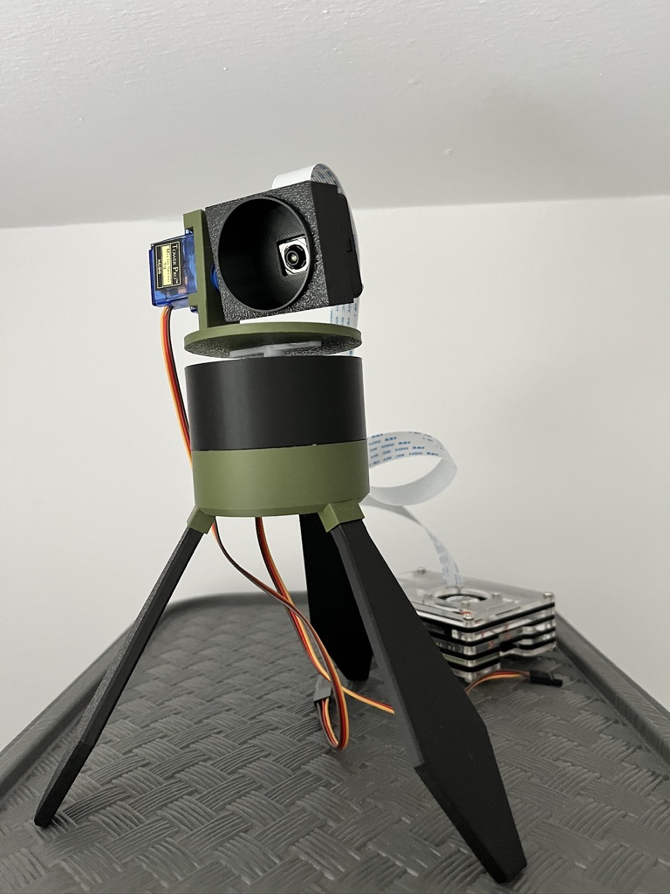

# Sentry GUI

This project features a graphical user interface (GUI) that controls a camera sentry system. The sentry is mounted on a custom-designed 3D printed frame, which allows for easy integration and movement. Powered by a Raspberry Pi 3B+, this system utilizes two Tower Pro SG90 servos to control the camera's movement, providing precise and responsive operation.

The main goal of this project is to provide a compact, efficient, and user-friendly interface for remotely monitoring and controlling the sentry. It allows for both manual control and automation based on user-defined parameters.

## Features:
- **Custom 3D printed sentry** for a unique design and flexibility. [Printables](https://www.printables.com/model/1177537-camera-module-3-sentry)
- **Raspberry Pi 3B+** as the central processing unit.
- **Dual servos (Tower Pro SG90)** for smooth and accurate movement.
- **Real-time video streaming** from the camera.

## Installation
Instructions for setting up the system and GUI will be added here.

## Usage
Details about how to use the GUI and control the sentry will be provided here.

## STL Files on Printables

